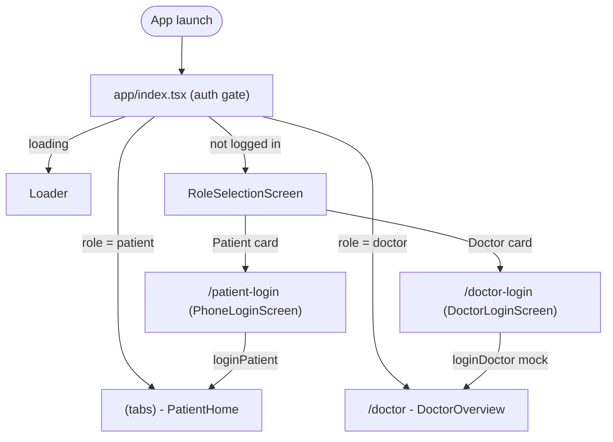

## 1. Theme Update (University Red / Gray)

Edit [`constants/design-system.ts`](constants/design-system.ts) so `DSColors` becomes the single source of truth for the new palette. Existing screens that already consume `DSColors.primary`, `DSColors.text.*`, `DSColors.background`, etc. will pick the new theme up automatically.

```ts
export const DSColors = {
  primary: "#A00000", // University Red
  primaryDark: "#7A0000",
  primaryLight: "#FCE9E9",
  secondary: "#333333", // Dark Gray
  secondaryLight: "#6B7280",
  background: "#F3F4F6", // Light Gray bg
  surface: "#FFFFFF",
  text: { primary: "#1F2937", secondary: "#6B7280", inverse: "#FFFFFF" },
  border: "#E5E7EB",
  borderLight: "#F3F4F6",
  success: "#10B981",
  successLight: "#ECFDF5",
  danger: "#EF4444",
  dangerLight: "#FEF2F2",
  warning: "#F59E0B",
  warningLight: "#FEF3C7",
} as const;
```

Mirror the brand tokens in [`tailwind.config.js`](tailwind.config.js) under `theme.extend.colors.brand` so NativeWind users can write `bg-brand-red`, `text-brand-gray`, `bg-brand-light`:

```js
brand: { red: '#A00000', redDark: '#7A0000', redLight: '#FCE9E9',
         gray: '#333333', grayLight: '#6B7280', light: '#F3F4F6' }
```

Also retune the tab tint in [`app/(tabs)/_layout.tsx`](<app/(tabs)/_layout.tsx>) — replace the hard-coded `TEAL`/`TEAL_DARK` constants with `DSColors.primary` so the bottom-tab active color matches the new red.

## 2. `CustomHeader` Component

Create [`components/CustomHeader.tsx`](components/CustomHeader.tsx) — a `SafeAreaView` + row with:

- Left: `Ionicons` `school` icon (24px, white) inside a circular badge as logo placeholder
- Center: text "Smart Rehab" (20px, weight 700, white)
- Right: optional `rightSlot` prop (e.g., logout/profile button)

Background `DSColors.primary`, soft shadow (`DSShadow`), 56px content height. Exposes `title?: string` to override the center text per screen.

## 3. New Screens

### `RoleSelectionScreen` — [`components/screens/RoleSelectionScreen.tsx`](components/screens/RoleSelectionScreen.tsx)

- Title: `กรุณาเลือกสถานะผู้ใช้งาน` (subtitle EN: "Please select your role")
- Two `Pressable` cards, `minHeight: 140` (h-32+), `borderRadius: 24`, `DSShadow`, white surface, left accent stripe in `DSColors.primary`:
  - `ผู้ป่วย (Patient)` — Ionicons `person-circle` + body line
  - `แพทย์ / นักกายภาพ (Doctor / Physical Therapist)` — Ionicons `medkit`
- Card press → calls `onSelect('patient' | 'doctor')` prop, which the route handler uses to `router.push('/patient-login' | '/doctor-login')`.

### `DoctorLoginScreen` — [`components/screens/DoctorLoginScreen.tsx`](components/screens/DoctorLoginScreen.tsx)

- Mockup: two `TextInput`s (Username, Password with `secureTextEntry`), primary "เข้าสู่ระบบ" button, secondary "ย้อนกลับ" link.
- Mirrors the styling of [`PhoneLoginScreen`](components/screens/PhoneLoginScreen.tsx) for visual consistency.
- Calls `onSuccess(username)` prop on submit; route file (below) hooks this into `auth.loginDoctor()`.

## 4. AuthContext: add role + doctor login

Extend [`contexts/AuthContext.tsx`](contexts/AuthContext.tsx) to persist a role alongside the existing phone:

```ts
type Role = "patient" | "doctor";
type AuthState = {
  isLoggedIn: boolean;
  isLoading: boolean;
  role: Role | null;
  identifier: string | null;
  loginPatient: (phone: string) => Promise<void>;
  loginDoctor: (username: string) => Promise<void>; // mock
  logout: () => Promise<void>;
};
```

Persist `@cpe465_auth_role` + `@cpe465_auth_id` in AsyncStorage. `logout` clears both keys.

## 5. Routing wire-up (Expo Router)

Refactor [`app/_layout.tsx`](app/_layout.tsx) so it always renders a single `Stack` (drop the inline `PhoneLoginScreen` shortcut) and applies `CustomHeader` everywhere via `screenOptions`:

```tsx
<Stack
  screenOptions={{
    header: () => <CustomHeader />,
    headerShown: true,
    contentStyle: { backgroundColor: DSColors.background },
  }}
>
  <Stack.Screen name="index" />
  <Stack.Screen name="patient-login" />
  <Stack.Screen name="doctor-login" />
  <Stack.Screen name="(tabs)" />
  <Stack.Screen name="doctor" />
  <Stack.Screen name="therapy-session" />
  <Stack.Screen name="manual-setup" />
  <Stack.Screen
    name="modal"
    options={{ presentation: "modal", headerShown: false }}
  />
</Stack>
```

Remove `unstable_settings.anchor = '(tabs)'` so the new index route runs first.

### Route files

- New [`app/index.tsx`](app/index.tsx) — auth gate:
  - `auth.isLoading` → spinner
  - `isLoggedIn && role === 'patient'` → `<Redirect href="/(tabs)" />`
  - `isLoggedIn && role === 'doctor'` → `<Redirect href="/doctor" />`
  - else → `<RoleSelectionScreen onSelect={role => router.push('/' + role + '-login')} />`
- Rename [`app/login.tsx`](app/login.tsx) → `app/patient-login.tsx`; on success: `await auth.loginPatient(phone); router.replace('/(tabs)')`.
- New `app/doctor-login.tsx` — wraps `DoctorLoginScreen`; on success: `await auth.loginDoctor(username); router.replace('/doctor')`.

### Per-screen header tweaks

Override `options.header`/`options.title` only where useful (e.g., RoleSelection has no back button: pass `header: () => <CustomHeader />`; PatientLogin/DoctorLogin pass a back-button variant). Tabs and `doctor` keep the default global header.

## 6. Flow diagram



## Files touched

- Edit: `constants/design-system.ts`, `tailwind.config.js`, `contexts/AuthContext.tsx`, `app/_layout.tsx`, `app/(tabs)/_layout.tsx`
- New: `components/CustomHeader.tsx`, `components/screens/RoleSelectionScreen.tsx`, `components/screens/DoctorLoginScreen.tsx`, `app/index.tsx`, `app/patient-login.tsx`, `app/doctor-login.tsx`
- Delete: `app/login.tsx` (replaced by `patient-login.tsx`)

## Out of scope

- Doctor backend auth (kept as a mock that always succeeds).
- Re-theming the deep gluestack-ui `--color-primary-*` CSS variables (those tokens stay; new screens use `DSColors`/`brand` tokens directly so they always render red).
